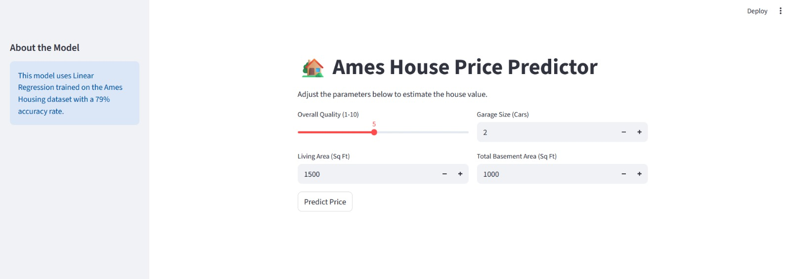

# House Price Prediction Project 🏠

## 📌 Project Overview

Built as part of my internship, this project predicts residential house prices using the Ames Housing dataset. It implements a Linear Regression model focusing on key features like overall quality and living area.

## 📊 Key Findings

- **Top Feature:** Overall Quality was the strongest predictor of price.
- **Model Performance:** - **R² Score:** [0.79]
  - **Mean Absolute Error (MAE):** [$26,473.59]

## 🛠️ Tech Stack

- **Language:** Python
- **Libraries:** Scikit-Learn, Pandas, Seaborn, Matplotlib

## 📈 Visualizations


## 🌐 Web Application Interface

I developed an interactive web dashboard using **Streamlit** to allow users to input property details and receive instant price predictions.

### ✨ Features:

- **Interactive Sliders:** Adjust house quality and square footage.
- **Real-time Prediction:** Instant market value estimation using the trained model.
- **Custom UI:** A premium dark-themed interface designed for real estate professionals.

### 📸 Preview:



### 🛠️ How to Launch the App:

1. Ensure you have the dependencies installed:
   ```powershell
   pip install streamlit joblib
   ```
